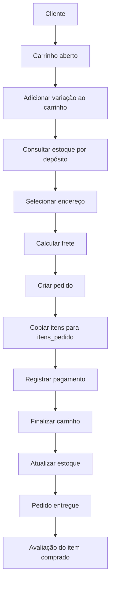

# Fluxo do carrinho até o pedido

Este documento representa o fluxo de compra desde a criação do carrinho até o registro do pedido e do pagamento.

## 1. Cliente possui um carrinho

O cliente possui um carrinho com status `aberto`.

```text
clientes 1:N carrinhos
```

Um cliente pode possuir vários carrinhos ao longo do tempo, mas cada carrinho pertence a apenas um cliente.

## 2. Produtos são adicionados ao carrinho

O cliente escolhe uma variação de produto e informa a quantidade desejada.

Essas informações são registradas em `carrinho_itens`.

```text
carrinhos 1:N carrinho_itens
variacoes_produto 1:N carrinho_itens
```

A tabela `carrinho_itens` armazena:

- o carrinho;
- a variação escolhida;
- a quantidade.

A mesma variação não pode aparecer duas vezes no mesmo carrinho. Caso o cliente adicione novamente o produto, a aplicação deve atualizar a quantidade.

## 3. Estoque é consultado

Antes da finalização da compra, a aplicação consulta a quantidade disponível da variação.

```text
variacoes_produto
    ↓
estoques
    ↓
depositos
```

Uma variação pode possuir estoque em mais de um depósito.

O estoque total é obtido pela soma das quantidades disponíveis nos depósitos.

## 4. Endereço e frete são definidos

O cliente seleciona um endereço de entrega.

A aplicação calcula o frete considerando:

- endereço de entrega;
- peso do produto;
- largura;
- altura;
- profundidade.

O banco não realiza o cálculo. Ele apenas armazena o resultado em `pedidos.valor_frete`.

## 5. Pedido é criado

Após a confirmação da compra, a aplicação cria um registro em `pedidos`.

O pedido armazena:

- cliente;
- endereço de entrega;
- status;
- valor do frete;
- valor total.

O status inicial pode ser:

```text
aguardando_pagamento
```

## 6. Itens são copiados para o pedido

Os itens do carrinho são copiados para `itens_pedido`.

```text
carrinho_itens
    ↓
itens_pedido
```

Cada item do pedido armazena:

- variação comprada;
- quantidade;
- preço unitário praticado no momento da compra.

O preço é armazenado no item para que alterações futuras no catálogo não modifiquem o histórico do pedido.

## 7. Pagamento é registrado

Após a criação do pedido, o pagamento é registrado em `pagamentos`.

```text
pedidos 1:N pagamentos
```

O pagamento armazena:

- forma de pagamento;
- status;
- valor;
- data do pagamento, quando existir.

Quando o pagamento for aprovado, o status do pedido pode ser alterado para `pago`.

## 8. Carrinho é finalizado

Depois que o pedido é criado, o carrinho passa do status:

```text
aberto
```

para:

```text
finalizado
```

O banco não possui uma chave estrangeira direta entre `carrinhos` e `pedidos`.

A transformação do carrinho em pedido é um processo executado pela aplicação, que cria o pedido e copia os itens.

## 9. Estoque é atualizado

Após a confirmação da compra, a aplicação reduz a quantidade disponível da variação no depósito escolhido.

O banco impede que a quantidade de estoque fique negativa.

## 10. Pedido segue seu fluxo

O pedido pode passar pelos seguintes status:

```text
aguardando_pagamento
pago
em_separacao
enviado
entregue
cancelado
```

## 11. Cliente pode avaliar a compra

Após a compra, o cliente pode registrar uma avaliação ligada ao item do pedido.

```text
itens_pedido 1:0..1 avaliacoes
```

Cada item comprado pode possuir no máximo uma avaliação.

## Resumo do fluxo

